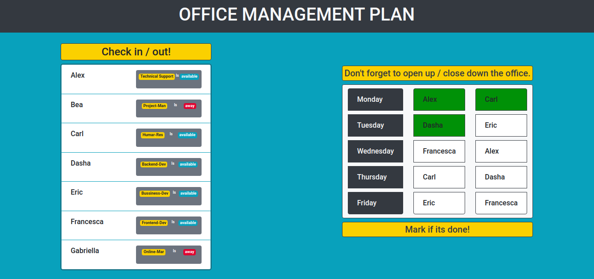

# Office Management tool

### Description

Simple application to organize the office's management.

Everyday in the morning we need an employee to open the office, the conference room, etc. In the afternoon we need another employee to lock-down the rooms before closing the office.

If an employee isn't available we need to change the weekly plan.

### Application features

A list of all the employee (provided)
An overview of available/unavailable employee
A weekly plan with the shifts for the available employee
Employee rotation always follows the same order
If an employee becomes unavailable the weekly plan will update accordingly

### Tech

- React
- Bootstrap

### Preview

[Go to app](http://https://office-management.now.sh/)
